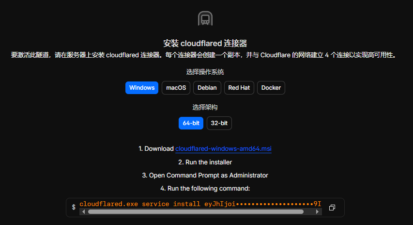
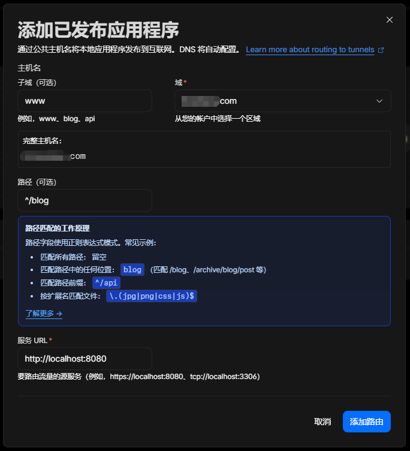
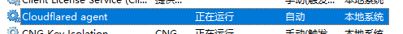
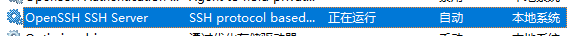
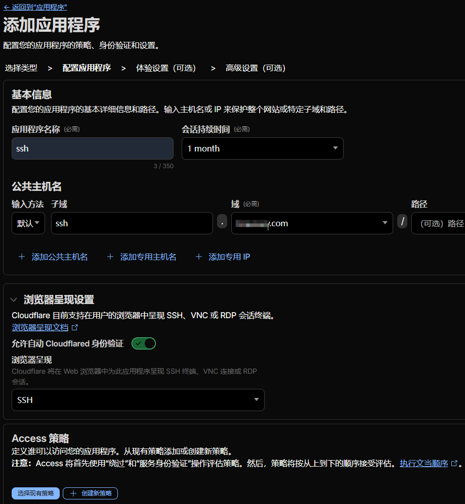
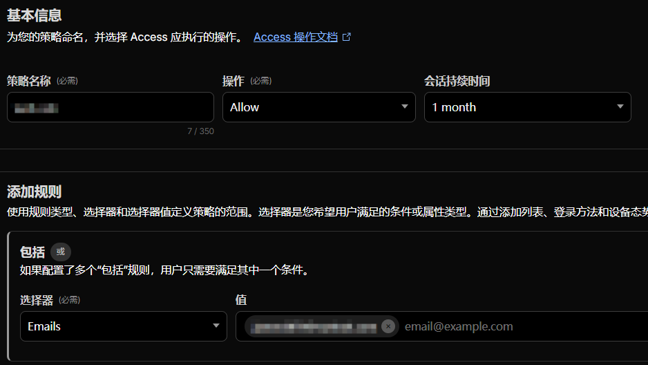

# Cloudflare Tunnel 内网穿透

本文介绍了通过 Cloudflare Tunnel 内网穿透，实现不同子域名映射到本地不同端口，配置 ssh 通道远程连接目标机器。

> 操作环境：Windows10 专业版，文中 Cloudflare 简称为 cf

## 域名托管

需要将域名托管到 cf 进行解析，如果托管的是顶级域名，例如 xxx.com 那么理论上可以配置无限多个子域名来映射到本地不同端口。
如果托管的是子域名，例如 api.xxx.com 那么就只能使用这个一个子域名映射一个端口了，也可以通过映射不同的路径来区分不同服务，但没有顶级域名方便。

## 部署通道

> 部署通道非常简单，按照网页中的提示执行傻瓜式操作就行了

1. 在 [cf 控制面板](https://dash.cloudflare.com/) 的左下角找到 联网 - 通道（tunnel），进入tunnel页面；
2. 创建一个通道，并点击进入创建的通道；
3. 之后按照提示去指定页面下载适合自己系统的 cloudflared 程序；
4. 按照提示执行程序，使用管理员权限执行网页中提供的命令；



5. 按照页面操作完成之后，页面会显示已连接；

## 配置路由

成功连接之后，我们需要添加路由，来决定哪个域名或者哪个路径对应本地的哪个服务。

1. 点击添加路由，选择“已发布应用程序”；
2. 填写子域名和本地服务地址，注意本地服务地址需要填http，而不是https，之后直接点击添加路由即可；



之后就能通过该子域名直接访问本地服务了，内网穿透成功！

## 服务管理

以上操作成功之后，Windows上会被添加一个 cloudflared 服务，用于处理通道

如果发现过一段时间发现服务在运行，但无法连接，可尝试以下命令

```powershell
# 停止服务
sc stop cloudflared

# 启动服务
sc start cloudflared

# 查看服务状态
sc query cloudflared
```

## 更换通道

如果想要在cf上创建新的通道，然后在本地执行命令，安装通道服务，需要先卸载之前的服务，之后再执行新通道提供的服务安装命令。

```powershell
# 卸载通道服务
cloudflared service uninstall
```

## SSH 穿透

### 安装 ssh server

服务需要安装ssh server，这里以Windows为例，以管理员身份运行 powershell，通过下面的命令检查或安装 ssh server

```powershell
# 检查 ssh server 是否已安装
Get-Service sshd

# 安装 ssh server
Add-WindowsCapability -Online -Name OpenSSH.Server~~~~0.0.1.0

# 启动 ssh srver
Start-Service sshd

# 设置开机自启
Set-Service -Name sshd -StartupType 'Automatic'
```



### web ssh

本地安装好 ssh server 之后，可以在 cf 中配置 ssh 路由，之后添加访问应用程序实现网页端 ssh，具体步骤如下。

在通道中添加路由，步骤同上，之后填写子域名，例如 ssh，之后服务 url 填 tcp://localhost:22。

进入 cf 的 zero trust 页面，点击访问控制，应用程序，之后创建一个子托管应用程序，

如下图，填写应用程序名称，例如 ssh，

会话持续时间可以选一个月，这样只需要一个月验证一次，

添加公共主机名 ssh.xxx.com

浏览器呈现设置中，激活 Cloudflared 身份验证，浏览器呈现选择 SSH，



之后在访问策略选项中，点击创建新策略，按照下图配置，使用邮箱验证码进行验证。



之后点击下一步，后面的页面都直接点击下一步，完成即可。

至此，访问 ssh 对应的子域名，完成邮箱验证，就会出现用户名密码验证，通过之后就能在浏览器中使用 ssh 了。

### xshell ssh

也可以配置 xshell 连接，步骤如下。

首先确保系统已有 cloudflared，之后在控制台中执行以下命令来启动一个 tcp 本地代理，代理到上面已经配置好的 ssh 子域名。

```powershell
cloudflared access tcp --hostname ssh.xxx.com --url localhost:2022
```

在 xshell 的连接配置中，配置主机名和端口，127.0.0.1:2022，

之后配置用户名和密码，点击连接，

之后浏览器会跳出 cf 的认证页面，认证通过后即可成功连接 xshell，

实测响应速度和浏览器中的 ssh 没有区别，在国内使用都是卡顿的，这可能和 cf 服务器的距离有关。
